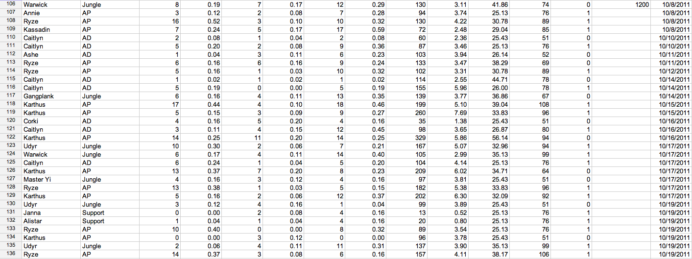
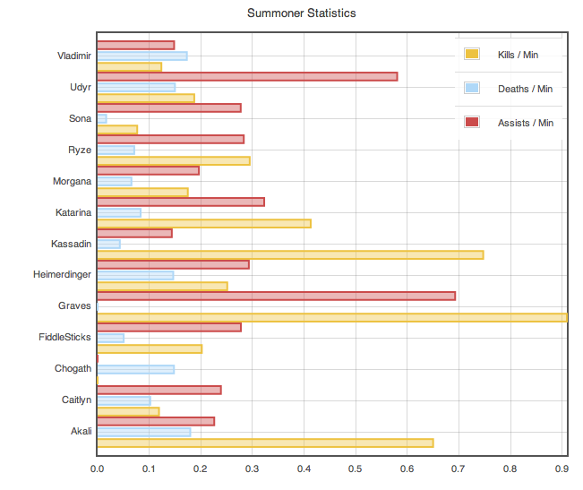

Web-Based Data Analytics in Haskell
================================

## CS240H project

* Drew Haven
* Eric Stratmann

Introduction
================================
Goal: make it easy to write Websites to analyze arbitrary data

We wrote a data query package to run map reduce queries on MongoDB

We built a site using Yesod that analyzes League of Legends data

Project components:

> * Website
> * Chart creation
> * Data analysis
> * Log parser
> * Log client

Motivations for this project
================================

I love data.  Hopefully this doesn't look familiar to anyone.

Motivations for this project
================================

Data analysis is fun.

Haskell is fun.

Data analysis + Haskell = loads of fun(?)

## Being practical

Haskell is great at generalizations, but it's often easiest to start with a practical case.  I (Drew) have been collecting this data for a few months now, and it is complex enough to supply an interesting test-set.

Yesod
================================

* MVC RESTful Web Framework
* Uses type safety to ensure correctness and prevents security vulnerabilities
* Includes DSLs/templates for HTML, CSS, and Javascript
* Uses Haskell extensions like QuasiQuotes, TemplateHaskell, TypeFamilies, and MultiParamTypeClasses

# Yesod site

`Game.hs`

~~~ {.haskell}
getGameIndexR :: Handler RepHtml
getGameIndexR = do
    (games, pagerOpts) <- paginateSelectList 10 [] []
    defaultLayout $ do
        let gameList = $(widgetFile "game/list")
        setTitle "Game Index"
        toWidget [cassius|
            ##header { float: left; color = #{color}}
        |] 
        $(widgetFile "game/index")
~~~

`game/list.hamlet`

~~~ {.html}
<div.game-list>
    $if null games
        No games found.
    $else
        ^{pager pagerOpts}

        <table.game-list>
            <thead>
                <tr>
                    <th>
                        Teams
                    <th>
                        Queue
                    <th>
                        Date Added
            <tbody>
                $forall game <- games
                    <tr data-href=@{GameViewR (fst game)}>
                        <td.champs>
                            ^{portraits champions (snd game)}
                        <td.queueType>
                            #{gsqueueType (gameGameStats (snd game))}
                        <td.created>
                            #{gameFormattedCreateTime (snd game)}

~~~

Chart generation
================================
Created Haskell bindings to create Javascript based charts using Flot

Allows developers to specify chart formatting and data 

Chart generation
================================

Generated with 

~~~ {.haskell}

getSummonerStatsR :: Text -> Handler RepHtml
getSummonerStatsR summonerName = do
    -- DB Calls
    dataRows <- runDB . runMapReduce $ buildQuery (QGameChampion summonerName)
        [exists $ QGameSummoner summonerName] columns

    -- Intermediate data
    let series = getSeries dataRows

    -- Widget
    defaultLayout $ do
        setTitle . toHtml $ T.append "Stats for " summonerName
        let stats = makeChart summonerChart series
        $(widgetFile "summoner/view")

summonerChart :: ChartInfo
summonerChart =
    setTitles "Summoner Statistics" "" "" $
    setHorizontal True $
    setSize 600 400 $
    barChart
~~~

Working with Data
================================

## Database

We chose MongoDB for our database.

* *Supports a document-oriented model,* useful for our complex data type.
* *Scalable* for managing millions of potential data points.
* *Built-in Map-Reduce* for running complex queries across documents.

Working with Data
================================

## The data

This is an example of one of our records:

~~~ {.json}
{
    "_id" : ObjectId("4edd4525e34614f263000000"),
    "created" : ISODate("2011-12-05T22:26:45.857Z"),
    "gameStats" : {
        "basePoints" : NumberLong(69),
        "boostIpEarned" : NumberLong(0),
        "boostXpEarned" : NumberLong(0),
        "completionBonusPoints" : NumberLong(0),
        "difficulty" : null,
        "elo" : NumberLong(0),
        "eloChange" : NumberLong(0),
        "expPointsToNextLevel" : NumberLong(0),
        "experienceEarned" : NumberLong(0),
        "experienceTotal" : NumberLong(115),
        "firstWinBonus" : NumberLong(0),
        "gameId" : NumberLong(245368572),
        "gameLength" : NumberLong(1839),
        "gameMode" : "CLASSIC",
        "gameType" : "MATCHED_GAME",
        "imbalancedTeamsNoPoints" : false,
        "invalid" : false,
        "ipEarned" : NumberLong(87),
        "ipTotal" : NumberLong(60594),
        "leveledUp" : false,
        "locationBoostIpEarned" : NumberLong(0),
        "locationBoostXpEarned" : NumberLong(0),
        "loyaltyBoostIpEarned" : NumberLong(0),
        "loyaltyBoostXpEarned" : NumberLong(0),
        "newSpells" : [ ],
        "odinBonusIp" : NumberLong(0),
        "otherTeamPlayerParticipantStats" : {
            "FUN Nuclear" : {
                "_profileIconId" : NumberLong(24),
                "_summonerName" : "FUN Nuclear",
                "botPlayer" : false,
                "elo" : NumberLong(0),
                "eloChange" : NumberLong(0),
                "gameId" : NumberLong(245368572),
                "gameItems" : [
                    NumberLong(3006),
                    NumberLong(2003),
                    NumberLong(1055),
                    NumberLong(3031),
                    NumberLong(1042)
                ],
                "inChat" : false,
                "isMe" : false,
                "leaver" : false,
                "leaves" : NumberLong(6),
                "level" : NumberLong(30),
                "losses" : NumberLong(244),
                "profileIconId" : NumberLong(24),
                "skinName" : "Caitlyn",
                "spell1Id" : NumberLong(12),
                "spell2Id" : NumberLong(4),
                "statistics" : {
                    "**ITEM0" : NumberLong(3006),
                    "**ITEM1" : NumberLong(2003),
                    "**ITEM2" : NumberLong(1055),
                    "**ITEM3" : NumberLong(3031),
                    "**ITEM4" : NumberLong(1042),
                    "**ITEM5" : NumberLong(0),
                    "Assists" : NumberLong(2),
                    "Champion Kills" : NumberLong(1),
                    "Champion Level" : NumberLong(13),
                    "Damage Dealt" : NumberLong(82672),
                    "Damage Taken" : NumberLong(14295),
                    "Deaths" : NumberLong(7),
                    "Gold Earned" : NumberLong(6591),
                    "Healing Done" : NumberLong(379),
                    "Inhibitors Destroyed" : NumberLong(0),
                    "Largest Critical Strike" : NumberLong(868),
                    "Largest Killing Spree" : NumberLong(0),
                    "Largest Multi Kill" : NumberLong(1),
                    "Losses" : NumberLong(1),
                    "Magic Damage Dealt" : NumberLong(1050),
                    "Magic Damage Taken" : NumberLong(10552),
                    "Minions Slain" : NumberLong(120),
                    "Neutral Monsters Killed" : NumberLong(2),
                    "Physical Damage Dealt" : NumberLong(81587),
                    "Physical Damage Taken" : NumberLong(3652),
                    "Time Spent Dead" : NumberLong(216),
                    "Turrets Destroyed" : NumberLong(1)
                },
                "teamId" : NumberLong(100),
                "userId" : NumberLong(22578746),
                "wins" : NumberLong(241)
            },
            "QuantumPHEAR" : {
                "_profileIconId" : NumberLong(16),
                "_summonerName" : "QuantumPHEAR",
                "botPlayer" : false,
                "elo" : NumberLong(0),
                "eloChange" : NumberLong(0),
                "gameId" : NumberLong(245368572),
                "gameItems" : [
                    NumberLong(3020),
                    NumberLong(3027),
                    NumberLong(3070),
                    NumberLong(1057),
                    NumberLong(1026)
                ],
                "inChat" : false,
                "isMe" : false,
                "leaver" : false,
                "leaves" : NumberLong(28),
                "level" : NumberLong(30),
                "losses" : NumberLong(399),
                "profileIconId" : NumberLong(16),
                "skinName" : "Kassadin",
                "spell1Id" : NumberLong(4),
                "spell2Id" : NumberLong(14),
                "statistics" : {
                    "**ITEM0" : NumberLong(3020),
                    "**ITEM1" : NumberLong(3027),
                    "**ITEM2" : NumberLong(3070),
                    "**ITEM3" : NumberLong(1057),
                    "**ITEM4" : NumberLong(1026),
                    "**ITEM5" : NumberLong(0),
                    "Assists" : NumberLong(1),
                    "Champion Kills" : NumberLong(4),
                    "Champion Level" : NumberLong(14),
                    "Damage Dealt" : NumberLong(64477),
                    "Damage Taken" : NumberLong(15256),
                    "Deaths" : NumberLong(4),
                    "Gold Earned" : NumberLong(7065),
                    "Healing Done" : NumberLong(1871),
                    "Inhibitors Destroyed" : NumberLong(0),
                    "Largest Critical Strike" : NumberLong(185),
                    "Largest Killing Spree" : NumberLong(2),
                    "Largest Multi Kill" : NumberLong(1),
                    "Losses" : NumberLong(1),
                    "Magic Damage Dealt" : NumberLong(47756),
                    "Magic Damage Taken" : NumberLong(5488),
                    "Minions Slain" : NumberLong(91),
                    "Neutral Monsters Killed" : NumberLong(23),
                    "Physical Damage Dealt" : NumberLong(16313),
                    "Physical Damage Taken" : NumberLong(9768),
                    "Time Spent Dead" : NumberLong(81),
                    "Turrets Destroyed" : NumberLong(0)
                },
                "teamId" : NumberLong(100),
                "userId" : NumberLong(21005873),
                "wins" : NumberLong(388)
            },
            "cade304" : {
                "_profileIconId" : NumberLong(0),
                "_summonerName" : "cade304",
                "botPlayer" : false,
                "elo" : NumberLong(0),
                "eloChange" : NumberLong(0),
                "gameId" : NumberLong(245368572),
                "gameItems" : [
                    NumberLong(1056),
                    NumberLong(3027),
                    NumberLong(3111),
                    NumberLong(1026)
                ],
                "inChat" : false,
                "isMe" : false,
                "leaver" : false,
                "leaves" : NumberLong(6),
                "level" : NumberLong(30),
                "losses" : NumberLong(393),
                "profileIconId" : NumberLong(0),
                "skinName" : "Morgana",
                "spell1Id" : NumberLong(4),
                "spell2Id" : NumberLong(3),
                "statistics" : {
                    "**ITEM0" : NumberLong(1056),
                    "**ITEM1" : NumberLong(3027),
                    "**ITEM2" : NumberLong(3111),
                    "**ITEM3" : NumberLong(1026),
                    "**ITEM4" : NumberLong(0),
                    "**ITEM5" : NumberLong(0),
                    "Assists" : NumberLong(3),
                    "Champion Kills" : NumberLong(3),
                    "Champion Level" : NumberLong(12),
                    "Damage Dealt" : NumberLong(47149),
                    "Damage Taken" : NumberLong(16667),
                    "Deaths" : NumberLong(5),
                    "Gold Earned" : NumberLong(6459),
                    "Healing Done" : NumberLong(286),
                    "Inhibitors Destroyed" : NumberLong(0),
                    "Largest Critical Strike" : NumberLong(143),
                    "Largest Killing Spree" : NumberLong(2),
                    "Largest Multi Kill" : NumberLong(1),
                    "Losses" : NumberLong(1),
                    "Magic Damage Dealt" : NumberLong(36856),
                    "Magic Damage Taken" : NumberLong(9622),
                    "Minions Slain" : NumberLong(65),
                    "Neutral Monsters Killed" : NumberLong(8),
                    "Physical Damage Dealt" : NumberLong(9693),
                    "Physical Damage Taken" : NumberLong(6964),
                    "Time Spent Dead" : NumberLong(125),
                    "Turrets Destroyed" : NumberLong(0)
                },
                "teamId" : NumberLong(100),
                "userId" : NumberLong(19564955),
                "wins" : NumberLong(412)
            },
            "skrilla" : {
                "_profileIconId" : NumberLong(13),
                "_summonerName" : "skrilla",
                "botPlayer" : false,
                "elo" : NumberLong(0),
                "eloChange" : NumberLong(0),
                "gameId" : NumberLong(245368572),
                "gameItems" : [
                    NumberLong(3154),
                    NumberLong(3111),
                    NumberLong(2003),
                    NumberLong(3134),
                    NumberLong(1038),
                    NumberLong(1053)
                ],
                "inChat" : false,
                "isMe" : false,
                "leaver" : false,
                "leaves" : NumberLong(3),
                "level" : NumberLong(30),
                "losses" : NumberLong(660),
                "profileIconId" : NumberLong(13),
                "skinName" : "Talon",
                "spell1Id" : NumberLong(11),
                "spell2Id" : NumberLong(4),
                "statistics" : {
                    "**ITEM0" : NumberLong(3154),
                    "**ITEM1" : NumberLong(3111),
                    "**ITEM2" : NumberLong(2003),
                    "**ITEM3" : NumberLong(3134),
                    "**ITEM4" : NumberLong(1038),
                    "**ITEM5" : NumberLong(1053),
                    "Assists" : NumberLong(4),
                    "Champion Kills" : NumberLong(1),
                    "Champion Level" : NumberLong(16),
                    "Damage Dealt" : NumberLong(111386),
                    "Damage Taken" : NumberLong(19150),
                    "Deaths" : NumberLong(4),
                    "Gold Earned" : NumberLong(7204),
                    "Healing Done" : NumberLong(1709),
                    "Inhibitors Destroyed" : NumberLong(0),
                    "Largest Critical Strike" : NumberLong(400),
                    "Largest Killing Spree" : NumberLong(0),
                    "Largest Multi Kill" : NumberLong(1),
                    "Losses" : NumberLong(1),
                    "Magic Damage Dealt" : NumberLong(21032),
                    "Magic Damage Taken" : NumberLong(7182),
                    "Minions Slain" : NumberLong(64),
                    "Neutral Monsters Killed" : NumberLong(65),
                    "Physical Damage Dealt" : NumberLong(86159),
                    "Physical Damage Taken" : NumberLong(11562),
                    "Time Spent Dead" : NumberLong(149),
                    "Turrets Destroyed" : NumberLong(1)
                },
                "teamId" : NumberLong(100),
                "userId" : NumberLong(488537),
                "wins" : NumberLong(747)
            },
            "zuhzuh" : {
                "_profileIconId" : NumberLong(8),
                "_summonerName" : "zuhzuh",
                "botPlayer" : false,
                "elo" : NumberLong(0),
                "eloChange" : NumberLong(0),
                "gameId" : NumberLong(245368572),
                "gameItems" : [
                    NumberLong(3111),
                    NumberLong(3027),
                    NumberLong(3109),
                    NumberLong(1031)
                ],
                "inChat" : false,
                "isMe" : false,
                "leaver" : false,
                "leaves" : NumberLong(12),
                "level" : NumberLong(30),
                "losses" : NumberLong(467),
                "profileIconId" : NumberLong(8),
                "skinName" : "Singed",
                "spell1Id" : NumberLong(12),
                "spell2Id" : NumberLong(6),
                "statistics" : {
                    "**ITEM0" : NumberLong(3111),
                    "**ITEM1" : NumberLong(3027),
                    "**ITEM2" : NumberLong(3109),
                    "**ITEM3" : NumberLong(1031),
                    "**ITEM4" : NumberLong(0),
                    "**ITEM5" : NumberLong(0),
                    "Assists" : NumberLong(3),
                    "Champion Kills" : NumberLong(4),
                    "Champion Level" : NumberLong(15),
                    "Damage Dealt" : NumberLong(79814),
                    "Damage Taken" : NumberLong(27738),
                    "Deaths" : NumberLong(6),
                    "Gold Earned" : NumberLong(8137),
                    "Healing Done" : NumberLong(4222),
                    "Inhibitors Destroyed" : NumberLong(0),
                    "Largest Critical Strike" : NumberLong(0),
                    "Largest Killing Spree" : NumberLong(2),
                    "Largest Multi Kill" : NumberLong(2),
                    "Losses" : NumberLong(1),
                    "Magic Damage Dealt" : NumberLong(75679),
                    "Magic Damage Taken" : NumberLong(13681),
                    "Minions Slain" : NumberLong(130),
                    "Neutral Monsters Killed" : NumberLong(3),
                    "Physical Damage Dealt" : NumberLong(4135),
                    "Physical Damage Taken" : NumberLong(14057),
                    "Time Spent Dead" : NumberLong(154),
                    "Turrets Destroyed" : NumberLong(1)
                },
                "teamId" : NumberLong(100),
                "userId" : NumberLong(19827594),
                "wins" : NumberLong(509)
            }
        },
        "pointsPenalties" : [ ],
        "practiceMinutesLeftToday" : NumberLong(180),
        "practiceMinutesPlayedToday" : null,
        "practiceMsecsUntilReset" : NumberLong(-1),
        "queueBonusEarned" : NumberLong(18),
        "queueType" : "NORMAL",
        "ranked" : false,
        "skinIndex" : NumberLong(0),
        "skinName" : null,
        "talentPointsGained" : NumberLong(0),
        "teamPlayerParticipantStats" : {
            "Fartjack100" : {
                "_profileIconId" : NumberLong(9),
                "_summonerName" : "Fartjack100",
                "botPlayer" : false,
                "elo" : NumberLong(0),
                "eloChange" : NumberLong(0),
                "gameId" : NumberLong(245368572),
                "gameItems" : [
                    NumberLong(1055),
                    NumberLong(3072),
                    NumberLong(3134),
                    NumberLong(3111),
                    NumberLong(1038),
                    NumberLong(3093)
                ],
                "inChat" : false,
                "isMe" : false,
                "leaver" : false,
                "leaves" : NumberLong(105),
                "level" : NumberLong(30),
                "losses" : NumberLong(841),
                "profileIconId" : NumberLong(9),
                "skinName" : "Riven",
                "spell1Id" : NumberLong(4),
                "spell2Id" : NumberLong(3),
                "statistics" : {
                    "**ITEM0" : NumberLong(1055),
                    "**ITEM1" : NumberLong(3072),
                    "**ITEM2" : NumberLong(3134),
                    "**ITEM3" : NumberLong(3111),
                    "**ITEM4" : NumberLong(1038),
                    "**ITEM5" : NumberLong(3093),
                    "Assists" : NumberLong(7),
                    "Champion Kills" : NumberLong(10),
                    "Champion Level" : NumberLong(16),
                    "Damage Dealt" : NumberLong(99015),
                    "Damage Taken" : NumberLong(15005),
                    "Deaths" : NumberLong(3),
                    "Gold Earned" : NumberLong(9821),
                    "Healing Done" : NumberLong(0),
                    "Inhibitors Destroyed" : NumberLong(0),
                    "Largest Critical Strike" : NumberLong(889),
                    "Largest Killing Spree" : NumberLong(7),
                    "Largest Multi Kill" : NumberLong(2),
                    "Magic Damage Dealt" : NumberLong(0),
                    "Magic Damage Taken" : NumberLong(6301),
                    "Minions Slain" : NumberLong(105),
                    "Neutral Monsters Killed" : NumberLong(26),
                    "Physical Damage Dealt" : NumberLong(98630),
                    "Physical Damage Taken" : NumberLong(8114),
                    "Time Spent Dead" : NumberLong(75),
                    "Turrets Destroyed" : NumberLong(1),
                    "Victories" : NumberLong(1)
                },
                "teamId" : NumberLong(200),
                "userId" : NumberLong(20073905),
                "wins" : NumberLong(865)
            },
            "JuicyDingo" : {
                "_profileIconId" : NumberLong(25),
                "_summonerName" : "JuicyDingo",
                "botPlayer" : false,
                "elo" : NumberLong(0),
                "eloChange" : NumberLong(0),
                "gameId" : NumberLong(245368572),
                "gameItems" : [
                    NumberLong(3096),
                    NumberLong(3132),
                    NumberLong(1028),
                    NumberLong(3111),
                    NumberLong(1029),
                    NumberLong(1033)
                ],
                "inChat" : false,
                "isMe" : false,
                "leaver" : false,
                "leaves" : NumberLong(3),
                "level" : NumberLong(30),
                "losses" : NumberLong(168),
                "profileIconId" : NumberLong(25),
                "skinName" : "Sona",
                "spell1Id" : NumberLong(4),
                "spell2Id" : NumberLong(2),
                "statistics" : {
                    "**ITEM0" : NumberLong(3096),
                    "**ITEM1" : NumberLong(3132),
                    "**ITEM2" : NumberLong(1028),
                    "**ITEM3" : NumberLong(3111),
                    "**ITEM4" : NumberLong(1029),
                    "**ITEM5" : NumberLong(1033),
                    "Assists" : NumberLong(16),
                    "Champion Kills" : NumberLong(1),
                    "Champion Level" : NumberLong(13),
                    "Damage Dealt" : NumberLong(21423),
                    "Damage Taken" : NumberLong(12326),
                    "Deaths" : NumberLong(3),
                    "Gold Earned" : NumberLong(6246),
                    "Healing Done" : NumberLong(4775),
                    "Inhibitors Destroyed" : NumberLong(0),
                    "Largest Critical Strike" : NumberLong(108),
                    "Largest Killing Spree" : NumberLong(0),
                    "Largest Multi Kill" : NumberLong(1),
                    "Magic Damage Dealt" : NumberLong(12427),
                    "Magic Damage Taken" : NumberLong(5134),
                    "Minions Slain" : NumberLong(15),
                    "Neutral Monsters Killed" : NumberLong(1),
                    "Physical Damage Dealt" : NumberLong(8996),
                    "Physical Damage Taken" : NumberLong(6861),
                    "Time Spent Dead" : NumberLong(102),
                    "Turrets Destroyed" : NumberLong(1),
                    "Victories" : NumberLong(1)
                },
                "teamId" : NumberLong(200),
                "userId" : NumberLong(22073761),
                "wins" : NumberLong(177)
            },
            "MvP Tincho" : {
                "_profileIconId" : NumberLong(6),
                "_summonerName" : "MvP Tincho",
                "botPlayer" : false,
                "elo" : NumberLong(0),
                "eloChange" : NumberLong(0),
                "gameId" : NumberLong(245368572),
                "gameItems" : [
                    NumberLong(3028),
                    NumberLong(3111),
                    NumberLong(1033),
                    NumberLong(3102),
                    NumberLong(1031)
                ],
                "inChat" : false,
                "isMe" : false,
                "leaver" : false,
                "leaves" : NumberLong(3),
                "level" : NumberLong(30),
                "losses" : NumberLong(273),
                "profileIconId" : NumberLong(6),
                "skinName" : "Galio",
                "spell1Id" : NumberLong(4),
                "spell2Id" : NumberLong(12),
                "statistics" : {
                    "**ITEM0" : NumberLong(3028),
                    "**ITEM1" : NumberLong(3111),
                    "**ITEM2" : NumberLong(1033),
                    "**ITEM3" : NumberLong(3102),
                    "**ITEM4" : NumberLong(1031),
                    "**ITEM5" : NumberLong(0),
                    "Assists" : NumberLong(16),
                    "Champion Kills" : NumberLong(2),
                    "Champion Level" : NumberLong(14),
                    "Damage Dealt" : NumberLong(81509),
                    "Damage Taken" : NumberLong(13773),
                    "Deaths" : NumberLong(2),
                    "Gold Earned" : NumberLong(7442),
                    "Healing Done" : NumberLong(2934),
                    "Inhibitors Destroyed" : NumberLong(0),
                    "Largest Critical Strike" : NumberLong(0),
                    "Largest Killing Spree" : NumberLong(0),
                    "Largest Multi Kill" : NumberLong(1),
                    "Magic Damage Dealt" : NumberLong(69019),
                    "Magic Damage Taken" : NumberLong(5353),
                    "Minions Slain" : NumberLong(112),
                    "Neutral Monsters Killed" : NumberLong(5),
                    "Physical Damage Dealt" : NumberLong(12490),
                    "Physical Damage Taken" : NumberLong(8420),
                    "Time Spent Dead" : NumberLong(42),
                    "Turrets Destroyed" : NumberLong(0),
                    "Victories" : NumberLong(1)
                },
                "teamId" : NumberLong(200),
                "userId" : NumberLong(24705774),
                "wins" : NumberLong(269)
            },
            "ShaperOfChaos" : {
                "_profileIconId" : NumberLong(26),
                "_summonerName" : "ShaperOfChaos",
                "botPlayer" : false,
                "elo" : NumberLong(0),
                "eloChange" : NumberLong(0),
                "gameId" : NumberLong(245368572),
                "gameItems" : [
                    NumberLong(3070),
                    NumberLong(3110),
                    NumberLong(2044),
                    NumberLong(3020),
                    NumberLong(3010)
                ],
                "inChat" : false,
                "isMe" : false,
                "leaver" : false,
                "leaves" : NumberLong(0),
                "level" : NumberLong(30),
                "losses" : NumberLong(179),
                "profileIconId" : NumberLong(26),
                "skinName" : "Ryze",
                "spell1Id" : NumberLong(4),
                "spell2Id" : NumberLong(3),
                "statistics" : {
                    "**ITEM0" : NumberLong(3070),
                    "**ITEM1" : NumberLong(3110),
                    "**ITEM2" : NumberLong(2044),
                    "**ITEM3" : NumberLong(3020),
                    "**ITEM4" : NumberLong(3010),
                    "**ITEM5" : NumberLong(0),
                    "Assists" : NumberLong(13),
                    "Champion Kills" : NumberLong(5),
                    "Champion Level" : NumberLong(16),
                    "Damage Dealt" : NumberLong(68699),
                    "Damage Taken" : NumberLong(11597),
                    "Deaths" : NumberLong(4),
                    "Gold Earned" : NumberLong(7683),
                    "Healing Done" : NumberLong(468),
                    "Inhibitors Destroyed" : NumberLong(0),
                    "Largest Critical Strike" : NumberLong(234),
                    "Largest Killing Spree" : NumberLong(2),
                    "Largest Multi Kill" : NumberLong(2),
                    "Magic Damage Dealt" : NumberLong(60392),
                    "Magic Damage Taken" : NumberLong(5579),
                    "Minions Slain" : NumberLong(75),
                    "Neutral Monsters Killed" : NumberLong(19),
                    "Physical Damage Dealt" : NumberLong(8307),
                    "Physical Damage Taken" : NumberLong(6018),
                    "Time Spent Dead" : NumberLong(78),
                    "Turrets Destroyed" : NumberLong(1),
                    "Victories" : NumberLong(1)
                },
                "teamId" : NumberLong(200),
                "userId" : NumberLong(24073547),
                "wins" : NumberLong(214)
            },
            "fbmmevan" : {
                "_profileIconId" : NumberLong(8),
                "_summonerName" : "fbmmevan",
                "botPlayer" : false,
                "elo" : NumberLong(0),
                "eloChange" : NumberLong(0),
                "gameId" : NumberLong(245368572),
                "gameItems" : [
                    NumberLong(3020),
                    NumberLong(3152),
                    NumberLong(3070),
                    NumberLong(2003),
                    NumberLong(3089),
                    NumberLong(1052)
                ],
                "inChat" : false,
                "isMe" : false,
                "leaver" : false,
                "leaves" : NumberLong(8),
                "level" : NumberLong(30),
                "losses" : NumberLong(361),
                "profileIconId" : NumberLong(8),
                "skinName" : "Karthus",
                "spell1Id" : NumberLong(12),
                "spell2Id" : NumberLong(10),
                "statistics" : {
                    "**ITEM0" : NumberLong(3020),
                    "**ITEM1" : NumberLong(3152),
                    "**ITEM2" : NumberLong(3070),
                    "**ITEM3" : NumberLong(2003),
                    "**ITEM4" : NumberLong(3089),
                    "**ITEM5" : NumberLong(1052),
                    "Assists" : NumberLong(5),
                    "Champion Kills" : NumberLong(8),
                    "Champion Level" : NumberLong(17),
                    "Damage Dealt" : NumberLong(107408),
                    "Damage Taken" : NumberLong(11647),
                    "Deaths" : NumberLong(1),
                    "Gold Earned" : NumberLong(9979),
                    "Healing Done" : NumberLong(960),
                    "Inhibitors Destroyed" : NumberLong(0),
                    "Largest Critical Strike" : NumberLong(0),
                    "Largest Killing Spree" : NumberLong(5),
                    "Largest Multi Kill" : NumberLong(1),
                    "Magic Damage Dealt" : NumberLong(101150),
                    "Magic Damage Taken" : NumberLong(3550),
                    "Minions Slain" : NumberLong(185),
                    "Neutral Monsters Killed" : NumberLong(2),
                    "Physical Damage Dealt" : NumberLong(5953),
                    "Physical Damage Taken" : NumberLong(7991),
                    "Time Spent Dead" : NumberLong(40),
                    "Turrets Destroyed" : NumberLong(0),
                    "Victories" : NumberLong(1)
                },
                "teamId" : NumberLong(200),
                "userId" : NumberLong(21568157),
                "wins" : NumberLong(365)
            }
        },
        "timeUntilNextFirstWinBonus" : NumberLong(74807513),
        "userId" : NumberLong(38318437)
    }
}
~~~

Working with Data
================================

## Integrating with Yesod

The Yesod team developed a package for database abstraction and access called Persistent.

> Persistent follows the guiding principles of type safety and concise, declarative syntax. Some other nice features are:
>
> * Database-agnostic. There is first class support for PostgreSQL, SQLite and MongoDB.
> * By being non-relational in nature, we simultaneously are able to support a wider number of storage layers and are not constrained by some of the performance bottlenecks incurred through joins.
> * A major source of frustration in dealing with SQL databases is changes to the schema. Persistent can automatically perform database migrations.

-- From the Yesod Book

Working with Data
================================

### Syntax Example

~~~
Email
    email Text
    user UserId Maybe
    verkey Text Maybe
    UniqueEmail email
~~~

Limited, yet powerful, operations.  It uses phantom types, type classes, and type families to ensure type safety.  TemplateHaskell and QuasiQuotes for easy development.

~~~ {.haskell}
type Game = GameGeneric backend
type GameId = Key backend Game
GameCreated :: EntityField Game UTCTime
GameGameStats :: EntityField Game GameStats

selectList :: (PersistEntity val, PersistBackend b m) => [Filter val] -> [SelectOpt val] -> b m [(Key b val, val)]
selectList [GameCreated <. time] [LimitTo 10] :: PersistBackend b m => b m [(GameId, Game)]
~~~

Note that:

* `backend` encodes the database type.
* `PersistEntity` defines columns and functions to transform the data to and from a database format.
* The return type of `selectList` is uniquely determined by the filters and options passed.  No where do you have to specify what type of data you are fetching.

Working with Data
================================

## Building a Map-Reduce framework

The basic interface:

~~~ {.haskell}
mapReduce :: (PersistBackend Action m, Applicative m, Queryable model)
       => QueryColumn model typ                     -- ^ The column to use a key.
       -> [QueryFilter model]                       -- ^ A list of filters.
       -> forall typ0. [QueryColumn model typ0]     -- ^ A list of columns to select for the output.
       -> Action m [(Label, M.Map Label Value)]
~~~

`Action m` corresponds to the `b m` above.  This function can essentially be used in exactly the same way.

### Dirty details

Behind the scenes, `Queryable` defines functions for transforming a map-reduce request into the requisite JavaScript to pass to MongoDB.

Other parts of the project
================================

In the interest of making this into a usable site, we need to get data into the database, and preferably from public users.

To do this we set out to write a program that can be run on Windows (yes, Windows) systems and would parse the game client's logs.

Other parts of the project
================================

## Parsing Logs

The logs are:

* Line-based text log messages
* Interesting data is produced by an object-dumping function of ActionScript (the client uses Adobe Air)
* Object structure is provided by indention levels.

Parsing `ActionScript -> GameStats` is a daunting problem.

We'll use JSON!

`ActionScript -> JSON` is essentially a 1-to-1 mapping, and we already have the wonderful Aeson package.

Other parts of the project
================================

## ASObject

The `ASObject` package is modeled on Aeson, as such, it provides the following parsing function:

~~~ {.haskell}
parseActionScript :: Parser ByteString ASValue
~~~

From here, it is a simple matter of mapping to JSON, which can then be uploaded.  On the server-side we use aeson and the `FromJSON` typeclass to parse the provided JSON into the GameStats that we save, doing a few transformations along the way to remove unnecessary data, duplicate data, and make it easier to query.

Other parts of the project
================================

## The Client

To build the client, we had two major issues:

* Locating the correct directory (Win32 Registry)
* Building a GUI for Windows users who aren't comfortable with a terminal.

For the GUI we chose to go with wxWidgets.

* Bad idea.
* Not functional (need to run certain functions before other functions in the IO monad)
* Built as a layer to interface with the C++ classes.
* But it mostly worked.

Demo
================================

<iframe src='http://lol.casualaddict.com/' width='100%' height='80%'></iframe>

Future directions
================================

What would be needed to bring this site to a production level?

* More work!
* Static file handling.  Yesod is not optimized for it.
* Load balancing and clustering.
* User accouts/permissions.  Fortunately most of this work has already been done.
* Development branch of Persistent has abstracted the query interface, making this work easier.
* Yesod itself still needs more development to be considered mature.
